<h1>Lista de Exercícios 01</h1>
<h2>Exercício 001 - Equação do 2 grau</h2>
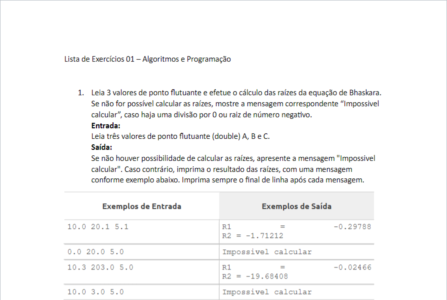

<h2>Exercício 002 - Média Ponderada</h2>
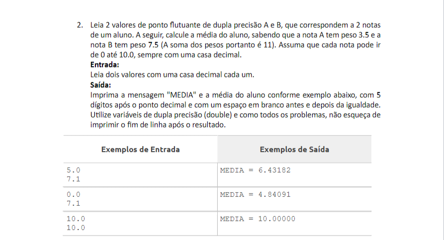

<h2>Exercício 003 - Menor quantidade de cédulas</h2>
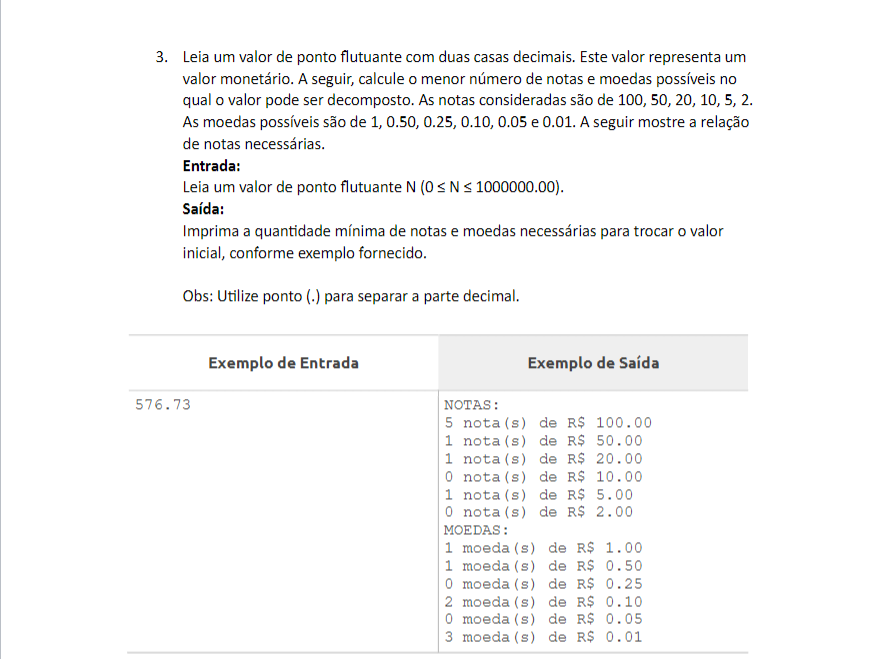

<h2>Exercício 004 - Soma de ímpares</h2>
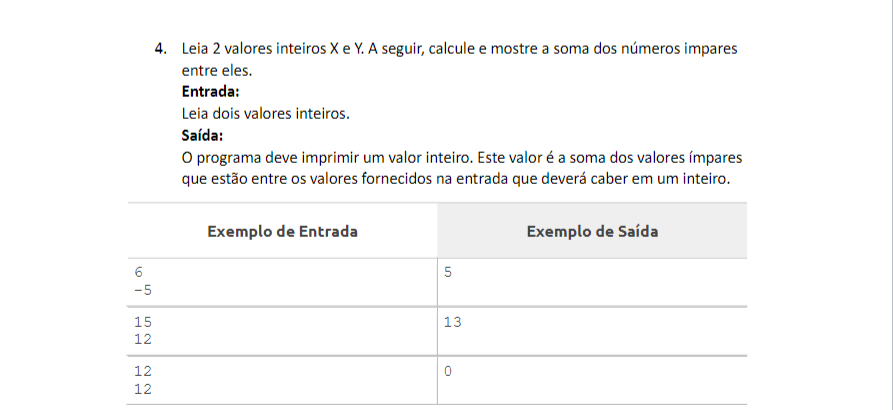

<h2>Exercício 005 - Classificar um triângulo</h2>
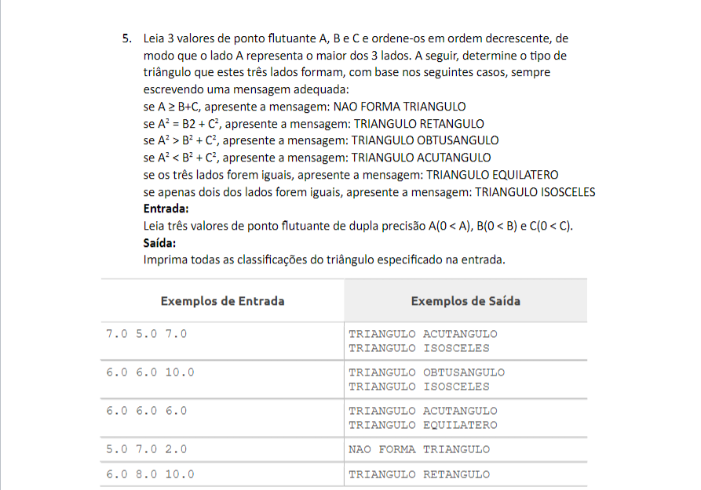

<h2>Exercício 006 - Sequência de Fibonacci</h2>
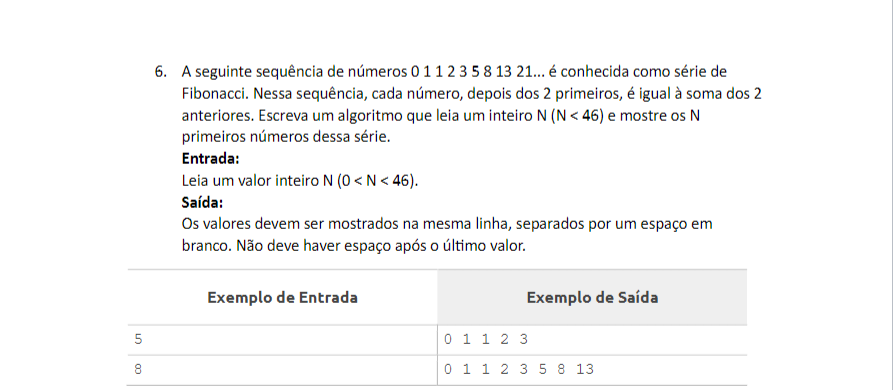

<h2>Exercício 007 - Número primo</h2>
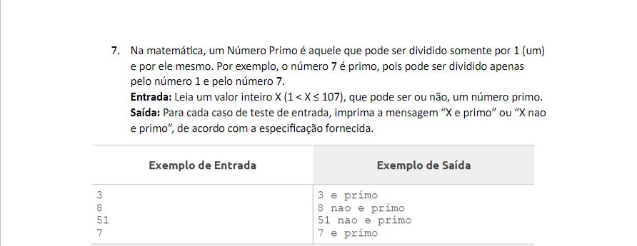

<h2>Exercício 008 - Número perfeito</h2>
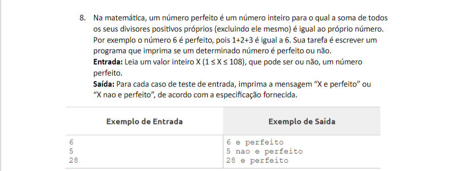

<h2>Exercício 009 - Base decimal para Hexadecimal</h2>
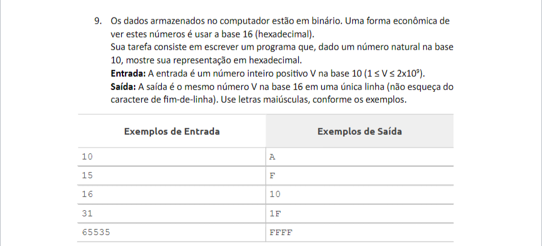

 

<h1>Lista de Exercícios 02</h1>

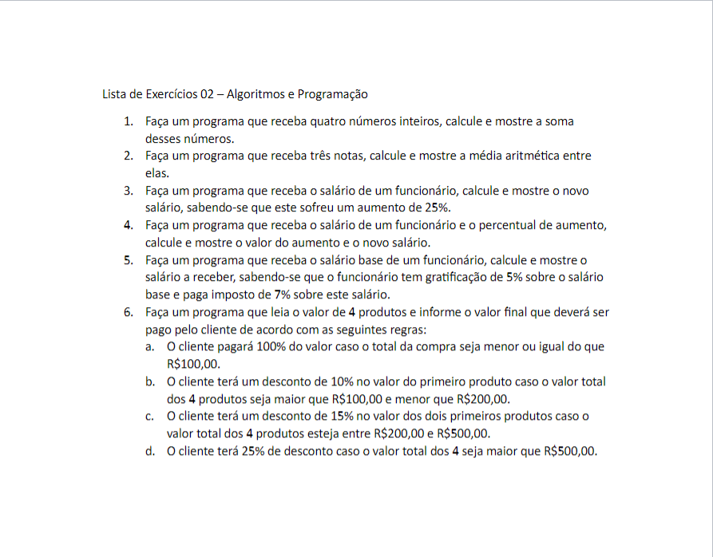

 

<h1>Lista de Exercícios 03</h1>

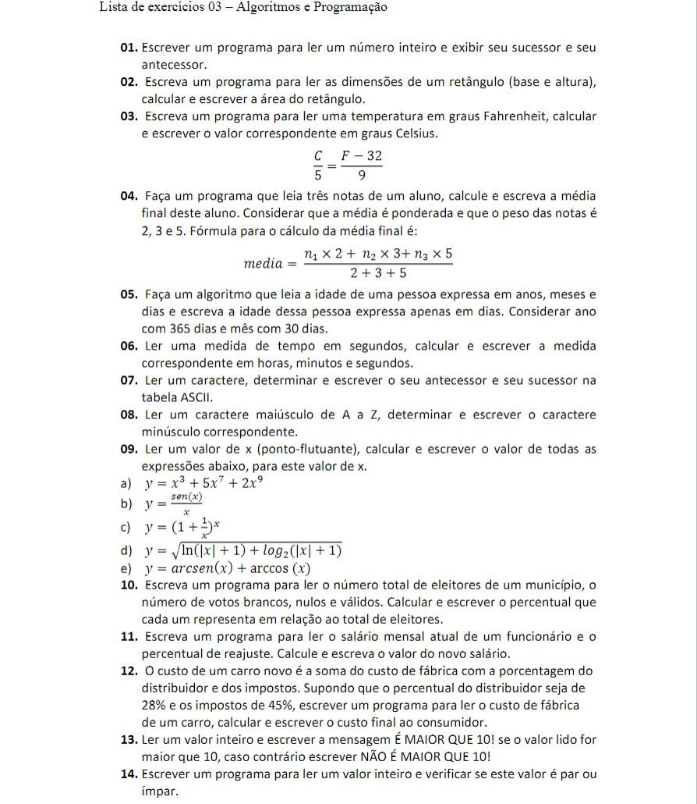

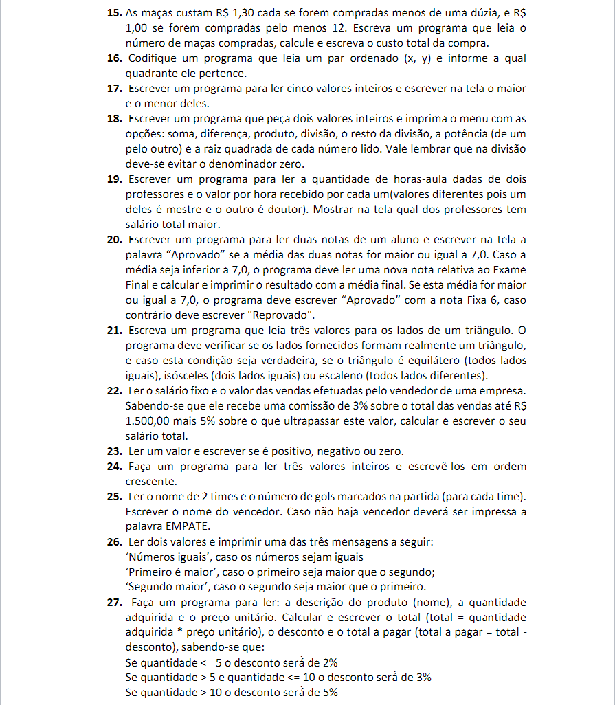
